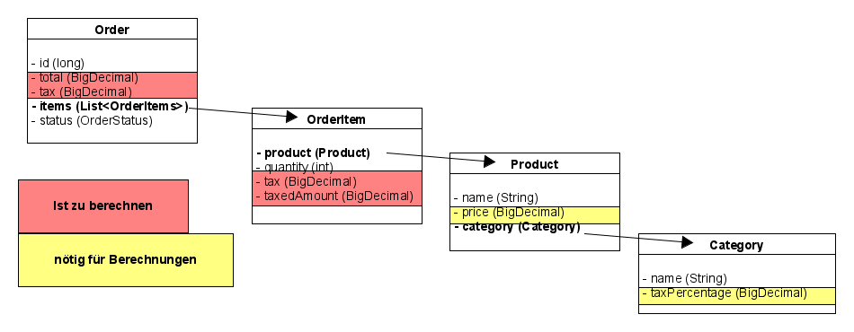

Bei den folgenden Übungen soll wartbarer Code im Fokus stehen. Es soll sowohl Funktionalität implementiert 
als auch refaktorisiert werden. Dabei darf jedes Stück Code angefasst werden, auch die Tests, solange
die Funktionalität erhalten bleibt.

# Order Approval Use Case

## Aufgabe:

Implementiere den `OrderApprovalUseCase`. Entferne dazu nach und nach `@Disabled` in `OrderApprovalUseCaseTest`,
mache die Tests grün und refaktorisiere. Das Bild unten von der (anfänglichen) Datenstruktur kann zur Orientierung 
dienen.

# Order Creation Use Case

## Ausgangslage als Bild

## Aufgabe:

Implementiere den `OrderCreationUseCase`. Entferne dazu nach und nach `@Disabled` in `OrderCreationUseCaseTest`,
mache die Tests grün und refaktorisiere.

